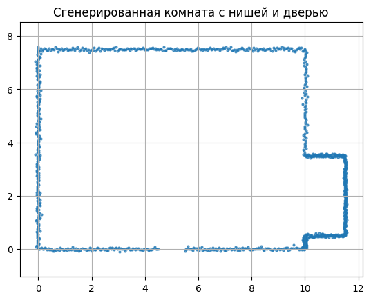
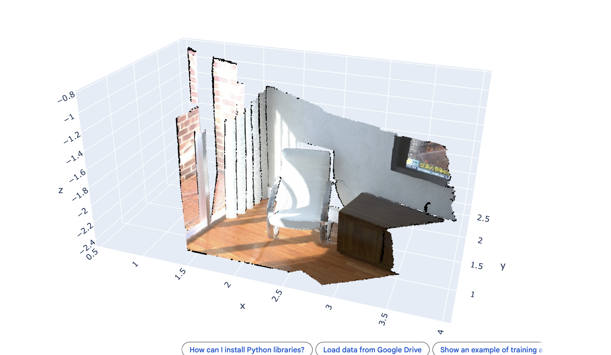
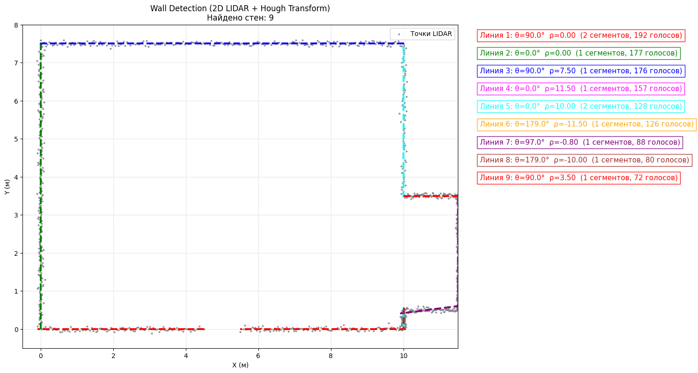
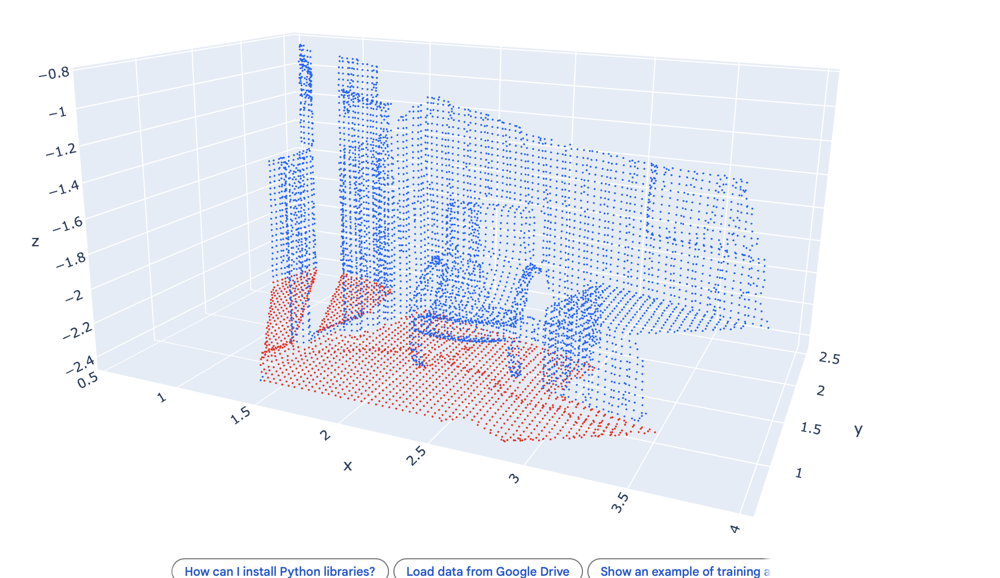

# Home assignment 1.1: Wall Detection (2D LIDAR + Hough Transform)

**Студент:** Иужанин Андрей (Iuzhanin Andrei)  
**GitHub:** [https://github.com/Juni0rResearcher/Hough-line-detector_RANSAC-plane-detector](https://github.com/Juni0rResearcher/Hough-line-detector_RANSAC-plane-detector)

## Описание проекта

Данный проект представляет собой решение домашнего задания по обнаружению стен (прямых линий) в облаке точек 2D-лидара с использованием преобразования Хафа. Также в проекте реализован алгоритм RANSAC для обнаружения плоскости пола на синтетических данных.

**Основные задачи:**
1.  Обнаружение прямых линий (стен) в облаке точек 2D-лидара.
2.  Использование преобразования Хафа для поиска линий.
3.  Реализация алгоритма RANSAC для поиска плоскости пола.
4.  Визуализация результатов обработки данных.

## Используемые данные

*   **Синтетические данные:** Генерация массива точек, образующих прямоугольник (контуры комнаты) с шумом (включая ниши и дверные проемы).

Пример синтетического датасета:


  
*   **Kitty Dataset:** скан комнаты.

Пример облака точек 3D сцены:



## Требования

Для запуска проекта необходимо установить следующие библиотеки Python:

```bash
pip install numpy
pip install open3d
pip install matplotlib
```

## Структура проекта

Проект реализован в виде Jupyter Notebook (`HW1_WallDetection_Iuzhanin_Andrei.ipynb`) и содержит следующие этапы:

1.  **Загрузка и предобработка данных:**
    *   Генерация синтетических точек (комната с нишей и дверью).
    *   Функция перевода координат из полярных в декартовы (`polar_to_cartesian`).


2.  **Преобразование Хафа (Hough Transform):**
    *   Построение аккумуляторного массива (`create_hough_accumulator`).
    *   Поиск пиков в аккумуляторе с адаптивным порогом.
    *   Применение Non-Maximum Suppression (NMS) для фильтрации близких линий.
    *   Группировка близких линий и подсчет инлайеров.
    *   Визуализация найденных линий стен поверх точек лидара.


3.  **Обнаружение плоскости пола (RANSAC):**
    *   Downsampling облака точек для ускорения обработки (`voxel_down_sample`).
    *   Реализация функции RANSAC для поиска плоскости (`ransac_ground`).
    *   Функция построения плоскости по 3 точкам (`fit_plane`).
    *   Визуализация найденной плоскости пола (красным цветом) на фоне облака точек (синим цветом).

## Результаты

В результате выполнения ноутбука осуществляются:
*   Визуализация облака точек 2D-лидара с наложенными линиями detected стен.



*   Визуализация синтетического облака точек с выделенной плоскостью пола, найденной с помощью RANSAC.




## Использование

1.  Клонируйте репозиторий:
    ```bash
    git clone https://github.com/Juni0rResearcher/Hough-line-detector_RANSAC-plane-detector.git
    ```
2.  Установите зависимости:
    ```bash
    pip install -r requirements.txt
    ```
3.  Запустите Jupyter Notebook:
    ```bash
    jupyter notebook HW1_WallDetection_Iuzhanin_Andrei.ipynb
    ```
