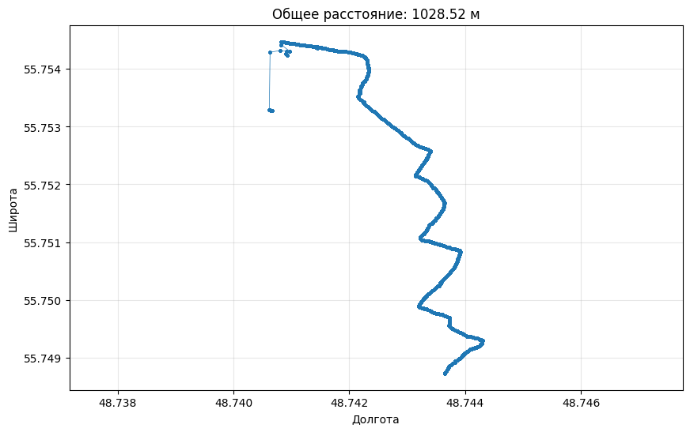
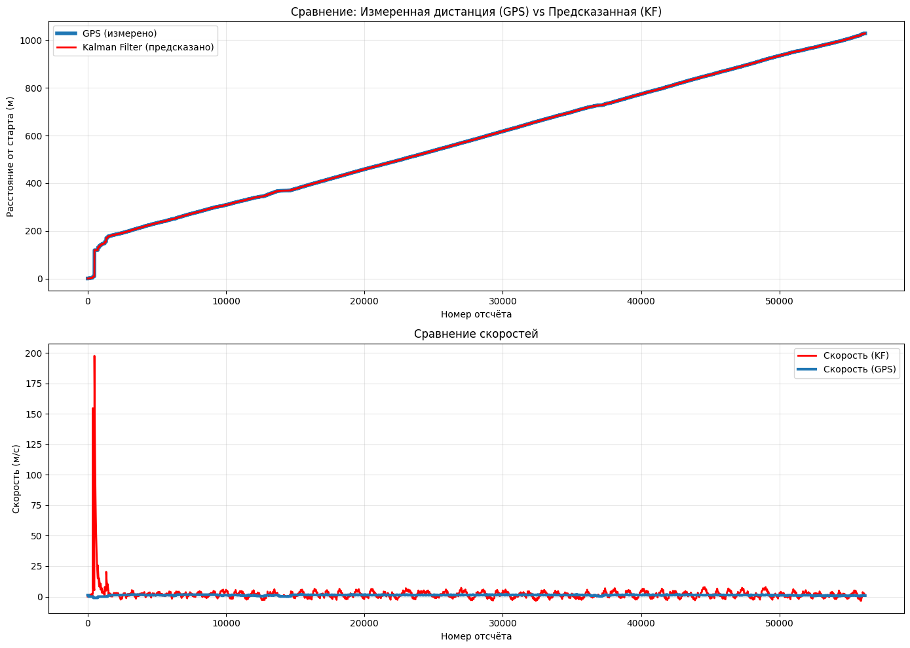

# Linear Kalman Filter for Smartphone Sensors

## 📋 Описание проекта

Данный проект представляет собой реализацию **линейного фильтра Калмана** для объединения показаний GPS и акселерометра смартфона с целью точной оценки пройденного пути.

**Студент:** Южанин Андрей  
**Домашнее задание:** №2

---

## 🎯 Задача

Используя смартфон, пройти определённую дистанцию на улице, записать данные с датчиков и с помощью фильтра Калмана объединить показания GPS и акселерометра для точной оценки пройденного пути.

**Цели:**
- Сбор данных с датчиков смартфона (GPS + акселерометр)
- Расчёт расстояния по формуле Haversine
- Оценка шумов процесса и измерений
- Реализация линейного фильтра Калмана
- Сравнение результатов GPS и фильтра Калмана

---

## 📊 Данные

Данные собраны с помощью приложения **Physics Toolbox Sensor Suite** на iOS.

| Параметр | Описание |
|----------|----------|
| **Дистанция** | ~1 км в городских условиях |
| **GPS** | Широта (Latitude), Долгота (Longitude) |
| **Акселерометр** | Ускорение по осям X, Y, Z (без гравитации) |
| **Частота дискретизации** | ~100 Гц (dt ≈ 0.01 с) |

Визуализация пути по данным GPS



### Структура CSV файла:
```
time, ax, ay, az, latitude, longitude, altitude, speed
```

---

## 🔧 Методы

### 1. Формула Haversine

Используется для вычисления кратчайшего расстояния между двумя точками на поверхности сферы (Земли) по их координатам:

$$
\begin{aligned}
a &= \sin^2\left(\frac{\phi_2 - \phi_1}{2}\right) + \cos\phi_1 \cos\phi_2 \sin^2\left(\frac{\lambda_2 - \lambda_1}{2}\right) \\
c &= 2 \cdot \operatorname{atan2}\left(\sqrt{a}, \sqrt{1-a}\right) \\
d &= R \cdot c
\end{aligned}
$$

Где:
- $\phi_1, \phi_2$ — широты точек (в радианах)
- $\lambda_1, \lambda_2$ — долготы точек (в радианах)
- $R$ — радиус Земли (≈ 6371 км)
- $d$ — искомое расстояние

### 2. Фильтр Калмана

Линейный фильтр Калмана для 1D трекинга с состоянием:

$$
\mathbf{x} = \begin{bmatrix} position \\ velocity \end{bmatrix}
$$

#### Шаг предсказания:
$$
\begin{aligned}
\hat{\mathbf{x}}_{k|k-1} &= \mathbf{F}_k \hat{\mathbf{x}}_{k-1|k-1} + \mathbf{B}_k \mathbf{u}_k \\
\mathbf{P}_{k|k-1} &= \mathbf{F}_k \mathbf{P}_{k-1|k-1} \mathbf{F}_k^\top + \mathbf{Q}_k
\end{aligned}
$$

#### Шаг коррекции:
$$
\begin{aligned}
\mathbf{K}_k &= \mathbf{P}_{k|k-1} \mathbf{H}_k^\top \left( \mathbf{H}_k \mathbf{P}_{k|k-1} \mathbf{H}_k^\top + \mathbf{R}_k \right)^{-1} \\
\hat{\mathbf{x}}_{k|k} &= \hat{\mathbf{x}}_{k|k-1} + \mathbf{K}_k \left( \mathbf{z}_k - \mathbf{H}_k \hat{\mathbf{x}}_{k|k-1} \right) \\
\mathbf{P}_{k|k} &= \left( \mathbf{I} - \mathbf{K}_k \mathbf{H}_k \right) \mathbf{P}_{k|k-1}
\end{aligned}
$$

#### Матрицы фильтра:
| Матрица | Описание |
|---------|----------|
| $\mathbf{F}$ | Матрица перехода состояния |
| $\mathbf{B}$ | Матрица управления |
| $\mathbf{H}$ | Матрица наблюдений |
| $\mathbf{Q}$ | Ковариация шума процесса (акселерометр) |
| $\mathbf{R}$ | Ковариация шума измерений (GPS) |
| $\mathbf{K}$ | Коэффициент Калмана |

---

## 📁 Структура проекта

```
├── HW2_LinearKalmanFilter_Iuzhanin_Andrei.ipynb  # Основной ноутбук
├── data/                                          # Папка с данными (CSV)
├── README.md                                      # Этот файл
└── requirements.txt                               # Зависимости
```

---

## 🚀 Установка и запуск

### 1. Клонирование репозитория

```bash
git clone <repository-url>
cd <repository-name>
```

### 2. Установка зависимостей

```bash
pip install -r requirements.txt
```

**Необходимые библиотеки:**
```
numpy
pandas
matplotlib
scipy
gdown
```

### 3. Запуск в Google Colab

1. Откройте [Google Colab](https://colab.research.google.com/)
2. Загрузите ноутбук `HW2_LinearKalmanFilter_Iuzhanin_Andrei.ipynb`
3. Запустите все ячейки последовательно

### 4. Локальный запуск

```bash
jupyter notebook HW2_LinearKalmanFilter_Iuzhanin_Andrei.ipynb
```

---

## 📈 Результаты

| Метрика | Значение |
|---------|----------|
| **Дистанция по GPS** | 1028.51 м |
| **Дистанция по KF** | 1028.51 м |
| **Разница в финальной дистанции** | 0.00 м |
| **Средняя абсолютная разница** | 0.00 м |
| **СКО разницы** | 0.00 м |

### Визуализация результатов:

1. **График траектории** — путь в координатах широта/долгота
2. **Сравнение дистанций** — GPS vs Kalman Filter
3. **Сравнение скоростей** — GPS скорость vs скорость от KF



---

## 🔍 Оценка шумов

### Шум процесса (акселерометр)
Определяется на участке с минимальным движением (скорость < 0.05 м/с):

| Ось | std_acc (м/с²) |
|-----|----------------|
| X | 0.2150 |
| Y | 0.2301 |
| Z | 0.1658 |
| **Максимальный** | **0.2301** |

### Шум измерений (GPS)
Определяется на стационарном участке:

| Ось | std_meas (м) |
|-----|--------------|
| X | 0.021 |
| Y | 0.006 |
| **Общий** | **0.022** |

---

## 📝 Ключевые функции

| Функция | Описание |
|---------|----------|
| `calculate_total_distance()` | Расчёт общего расстояния по формуле Haversine |
| `find_cleaner_stationary()` | Поиск участка с минимальным шумом для оценки параметров |
| `gps_to_local_meters()` | Преобразование GPS координат в локальные метры |
| `project_acceleration_to_motion_direction()` | Проецирование ускорения на направление движения |
| `KalmanFilter1D` | Класс линейного фильтра Калмана для 1D трекинга |
| `calculate_cumulative_distance()` | Расчёт кумулятивного пройденного пути |

---

## 💡 Выводы

1. **Фильтр Калмана успешно объединяет данные** GPS и акселерометра для оценки пути
2. **Высокое доверие к GPS данным** — фильтр практически полностью повторяет показания GPS
3. **Оценка шумов критически важна** — правильная калибровка Q и R матриц влияет на качество фильтрации
4. **Проекция ускорения** на направление движения улучшает точность предсказания
