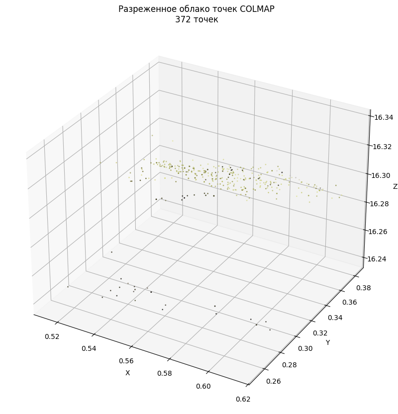
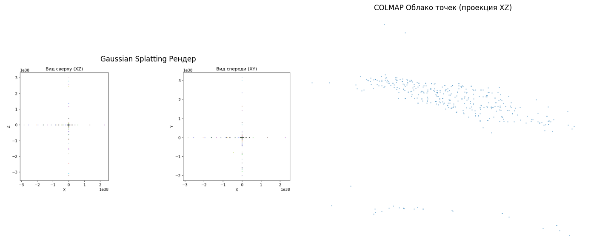

# Домашнее задание 4: 3D-реконструкция объектов методом Gaussian Splatting (GS)

Этот репозиторий содержит решение домашнего задания по 3D-реконструкции. Основная задача — реализовать полный конвейер для создания фотореалистичного «цифрового двойника» реального объекта с помощью классического Structure from Motion (COLMAP) и нейросетевого рендеринга (3D Gaussian Splatting).

## О проекте

В рамках работы были выполнены следующие этапы:

1.  **Сбор данных**: Съемка объекта (термос) на видео 4K с последующим извлечением кадров. Набор данных содержит 100 изображений, сделанных с разных ракурсов.
2.  **Предобработка**: Ограничение количества изображений до 50 для эффективной работы на GPU Tesla T4 в Google Colab.
3.  **Оценка положения камер (SfM)**: Запуск COLMAP для извлечения разреженного облака точек и параметров камер (внутренних и внешних).
4.  **Обучение 3D Gaussian Splatting**: Проведены два эксперимента:
    *   Короткое обучение (7 000 итераций).
    *   Полное обучение (15 000 итераций).
5.  **Анализ и визуализация**: Сравнение результатов COLMAP и Gaussian Splatting, анализ изменения количества гауссиан в процессе обучения.

## Установка и запуск

### Предварительные требования

*   Python 3.8+
*   NVIDIA GPU (рекомендуется) или Google Colab с GPU T4.
*   Учетная запись Google для монтирования Google Drive.

### Инструкция по запуску в Google Colab

1.  Откройте файл `HW4_Colmap_GaussianSplatting_Iuzhanin_Andrei.ipynb` в Google Colab.
2.  Перейдите в меню `Runtime` -> `Change runtime type` и выберите `T4 GPU` в качестве аппаратного ускорителя.
3.  Следуйте инструкциям в ноутбуке:
    *   Будет автоматически установлено необходимое программное обеспечение: PyTorch, COLMAP, библиотеки для Gaussian Splatting и другие зависимости.
    *   Вам будет предложено смонтировать Google Drive. Убедитесь, что ваш набор данных с изображениями находится по пути, указанному в переменной `DRIVE_IMAGES_PATH` (по умолчанию `"Colab Notebooks/Робототехника/ha4_images"`).
    *   После монтирования скрипт автоматически скопирует изображения из Google Drive, ограничит их количество для оптимальной работы и запустит пайплайн обработки.

## Результаты

### 1. Structure from Motion (COLMAP)

На первом этапе с помощью COLMAP было получено разреженное облако точек объекта. Как и ожидалось, облако получилось низкой плотности и не отражает детали объекта.

### 2. Gaussian Splatting

Результаты обучения 3D Gaussian Splatting оказались неутешительными. Качество реконструкции не достигло желаемого уровня. Скорее всего, это связано с недостаточным качеством исходных данных (сняты с видео, недостаточное перекрытие кадров) или с ограничениями, связанными с использованием GPU T4 и стандартных настроек обучения.

*   **Эксперимент 1 (7000 итераций):** [Изображение или видео результата]
*   **Эксперимент 2 (15000 итераций):** [Изображение или видео результата]

#### Сравнение COLMAP и GS

На изображении ниже можно наглядно увидеть разницу между разреженным облаком точек COLMAP и попыткой фотореалистичного рендеринга с помощью Gaussian Splatting. Оба метода не смогли сформировать качественную 3D-модель объекта.

## Выводы

1.  **Сбор данных критически важен.** Для успешной 3D-реконструкции необходимы высококачественные изображения с хорошим перекрытием (более 70%), снятые с разных уровней высоты. Видеосъемка, использованная в данной работе, не обеспечила нужного качества.
2.  **COLMAP** является мощным инструментом для оценки положения камер, но его работа напрямую зависит от качества входных данных. При недостаточно хорошем наборе изображений разреженное облако точек получается малопригодным для дальнейшей работы.
3.  **3D Gaussian Splatting** требует высококачественной инициализации от SfM. В данном случае, из-за недостатков данных, обучение не привело к созданию реалистичной модели.
4.  **Аппаратные ограничения** (GPU T4) и настройки по умолчанию также могли повлиять на финальный результат, особенно при работе с 50 изображениями.

## Структура репозитория

*   `HW4_Colmap_GaussianSplatting_Iuzhanin_Andrei.ipynb`: Основной Jupyter Notebook с кодом и комментариями.
*   `images/`: Папка, содержащая скриншоты результатов.
*   `README.md`: Данный файл.

## Используемые инструменты и библиотеки

*   **COLMAP**: Structure from Motion и Multi-View Stereo.
*   **3D Gaussian Splatting**: Нейросетевой рендеринг (`graphdeco-inria/gaussian-splatting`).
*   **PyTorch**: Фреймворк для глубокого обучения.
*   **OpenCV, Pillow, NumPy, Matplotlib**: Обработка изображений и визуализация.
*   **Nerfstudio**: Вспомогательная библиотека для обработки данных.
*   **Google Colab**: Среда выполнения с GPU.

## Автор

*   [Андрей Южанин] (https://github.com/Juni0rResearcher)
