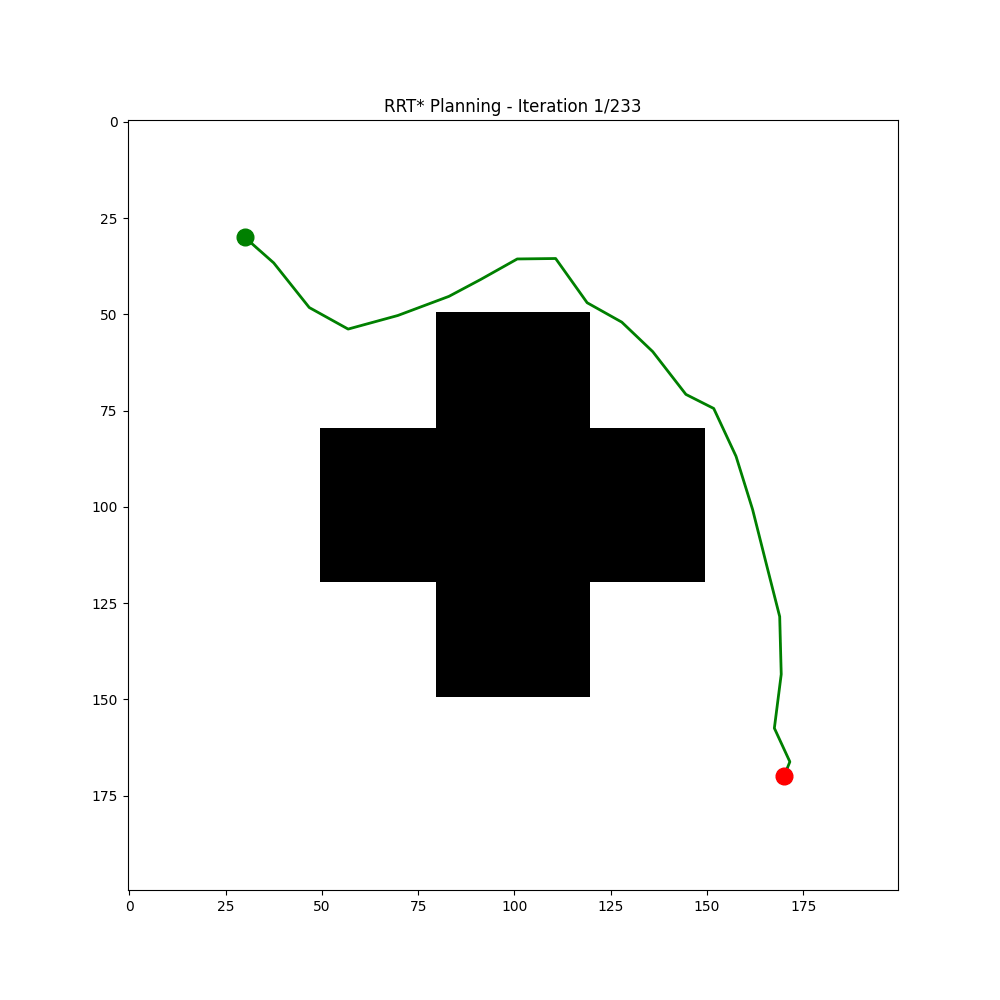
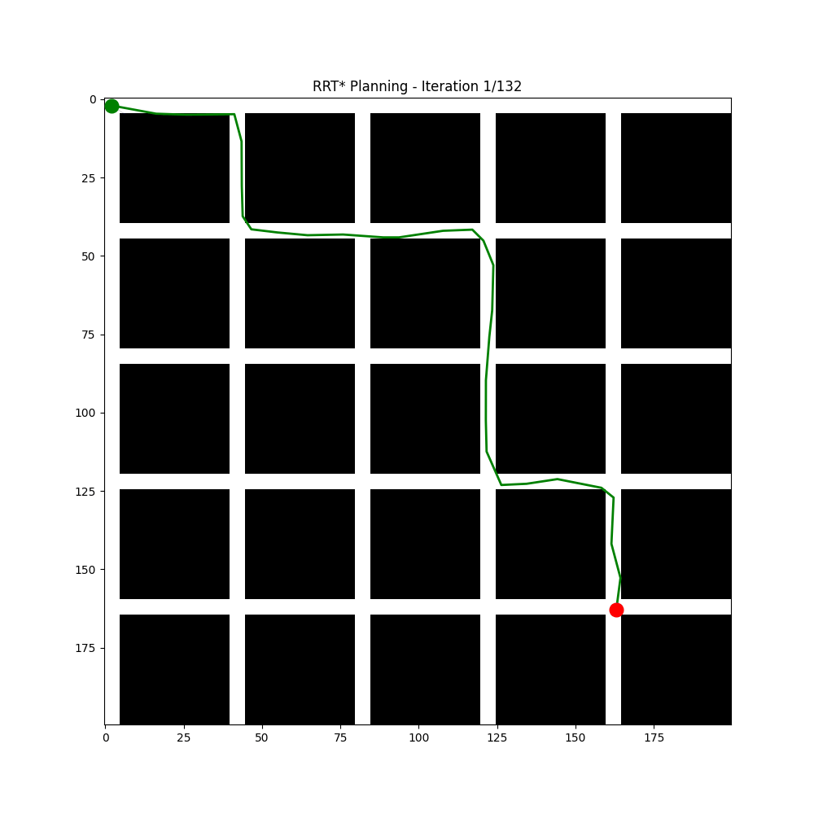
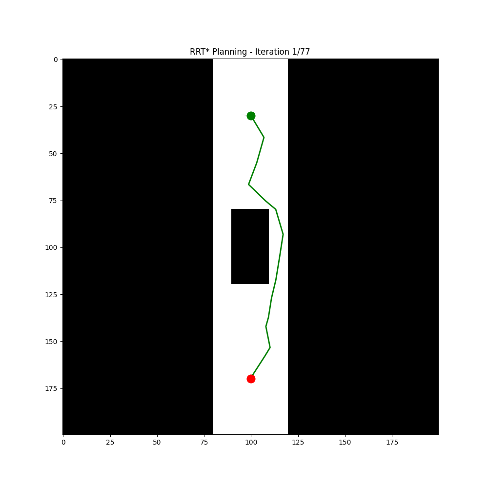

# 🤖 Планирование пути (Path Planning)

**Домашнее задание №5** | **MS25_RO_01** | **Андрей Южанин**

---

## 📋 Описание проекта

Данный проект представляет собой конвейер поиска пути в 2D пространстве с сравнением классических и современных алгоритмов планирования. Реализовано сравнение детерминированного поиска на сетке (**A***) с алгоритмами на основе случайного сэмплирования (**RRT*/RRT**), а также выполнена постобработка траектории.

---

## 🎯 Основные возможности

- ✅ **A* алгоритм** — классический детерминированный поиск на сетке
- ✅ **RRT* алгоритм** — вероятностный алгоритм с асимптотической оптимальностью
- ✅ **Сглаживание траектории** — градиентное сглаживание и кривые Безье
- ✅ **Визуализация** — сравнение траекторий, деревьев RRT*, метрик
- ✅ **Анимация** — GIF/MP4 анимация процесса поиска пути
- ✅ **Сравнительная таблица** — метрики производительности алгоритмов

---

## 📁 Структура проекта

```
HW5_PathPlanning/
├── HW5_PathPlanning_Iuzhain_Andrei_MS25_RO_01.ipynb  # Основной ноутбук
├── map_open.png          # Карта: открытое пространство
├── map_corridor.png      # Карта: узкий коридор
├── map_maze.png          # Карта: лабиринт
├── exp*_rrt_animation.gif # Анимации поиска пути
└── README.md             # Этот файл
```

---

## 🛠 Технические требования

### Зависимости
```bash
numpy>=1.20.0
matplotlib>=3.4.0
Pillow>=8.0.0
```

### Установка
```bash
# Установка зависимостей
pip install numpy matplotlib Pillow

# Или через requirements.txt
pip install -r requirements.txt
```

### Требования к среде
- Python 3.8+
- Jupyter Notebook / Google Colab
- Matplotlib для визуализации

---

## 🚀 Быстрый старт

### 1. Запуск в Google Colab
1. Откройте ноутбук в [Google Colab](https://colab.research.google.com/)
2. Загрузите файл `.ipynb`
3. Выполните все ячейки последовательно

### 2. Локальный запуск
```bash
# Клонируйте репозиторий
git clone <repository-url>
cd HW5_PathPlanning

# Установите зависимости
pip install -r requirements.txt

# Запустите ноутбук
jupyter notebook HW5_PathPlanning_Iuzhain_Andrei_MS25_RO_01.ipynb
```

### 3. Выбор карты для тестирования
В ячейке выбора карты укажите нужную карту:
```python
selected_map = 'map_open.png'      # Открытое пространство
# selected_map = 'map_corridor.png'  # Узкий коридор
# selected_map = 'map_maze.png'      # Лабиринт
```

---

## 📊 Сравнение алгоритмов

| Метрика | A* | RRT* |
|---------|-----|------|
| **Скорость** | Медленнее (полный перебор) | Быстрее (случайная выборка) |
| **Оптимальность** | Гарантированная | Асимптотическая |
| **Память** | Высокая | Низкая |
| **Узкие коридоры** | Хорошо | Может испытывать трудности |
| **Высокая размерность** | Плохо | Хорошо |

### Пример результатов:
```
Эксперимент 1 - Открытое пространство:
┌─────────────┬──────────────┬──────────────┐
│ Метрика     │ A*           │ RRT*         │
├─────────────┼──────────────┼──────────────┤
│ Время (с)   │ 0.516        │ 0.073        │
│ Узлы        │ 19,181       │ 154          │
│ Длина пути  │ 238.99       │ 235.87       │
│ Сглаженная  │ 224.21       │ 199.18       │
└─────────────┴──────────────┴──────────────┘
```

---

## 📈 Визуализация

Проект предоставляет 6 видов визуализации:

1. **A* путь** — исходный путь алгоритма A*
2. **A* сглаженный** — путь после градиентного сглаживания
3. **RRT* путь** — исходный путь алгоритма RRT*
4. **RRT* сглаженный** — путь после сглаживания Безье
5. **Дерево RRT*** — визуализация дерева поиска
6. **Сравнительная таблица** — метрики производительности

### Пример визуализации:

map_open


map_corridor


map_maze


---

## 🎬 Анимация

Проект включает анимацию процесса поиска пути RRT*:
- `exp1_rrt_animation.gif` — открытое пространство


  
- `exp3_rrt_animation.gif` — лабиринт


  
- `exp2_rrt_animation.gif` — узкий коридор



---

## 📚 Алгоритмы

### A* (A-Star)
Классический алгоритм поиска пути на графе с эвристикой.

**Преимущества:**
- ✅ Гарантирует оптимальный путь
- ✅ Полнота алгоритма
- ✅ Предсказуемое поведение

**Недостатки:**
- ❌ Высокое потребление памяти
- ❌ Медленная работа на больших картах

### RRT* (Rapidly-exploring Random Tree Star)
Улучшенная версия RRT с асимптотической оптимальностью.

**Преимущества:**
- ✅ Высокая скорость работы
- ✅ Эффективность в пространствах высокой размерности
- ✅ Меньшее использование памяти
- ✅ Асимптотическая оптимальность

**Недостатки:**
- ❌ Может испытывать трудности в узких коридорах
- ❌ Требует больше итераций для оптимальности

### Сглаживание траектории
Постобработка найденных путей для создания плавных траекторий.

**Методы:**
1. **Градиентное сглаживание** — итеративная оптимизация позиций точек
2. **Кривые Безье** — аппроксимация кубическими кривыми

---

## 🗂 Тестовые карты

| Карта | Описание | Старт | Цель |
|-------|----------|-------|------|
| `map_open.png` | Открытое пространство с препятствием | (30, 30) | (170, 170) |
| `map_corridor.png` | Узкий вертикальный коридор | (100, 30) | (100, 170) |
| `map_maze.png` | Лабиринт в виде сетки | (2, 2) | (163, 163) |

---

## 📊 Результаты экспериментов

### Ключевые выводы:

1. **Производительность**: RRT* работает в ~7 раз быстрее A* на открытых пространствах
2. **Количество узлов**: A* исследует ~19,000 узлов против ~150 у RRT*
3. **Оптимальность**: После сглаживания RRT* показывает лучшую длину пути
4. **Характер траекторий**: A* создаёт «угловатые» пути, RRT* — более плавные

### Влияние разрешения карты:
- **Высокое разрешение**: A* значительно замедляется
- **Низкое разрешение**: A* работает быстрее, но теряет точность
- **RRT***: Менее чувствителен к разрешению карты

---

## 👨‍💻 Автор

**Андрей Южанин**  
MS25_RO_01  
[GitHub](https://github.com/Juni0rResearcher)  
